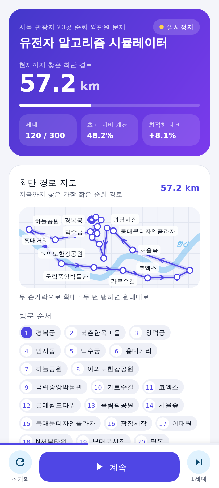
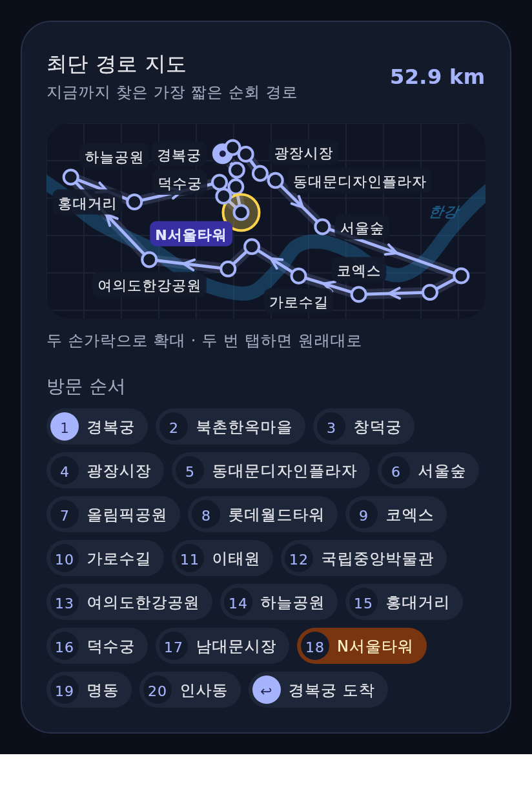
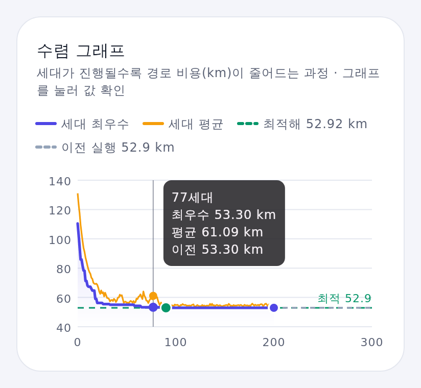
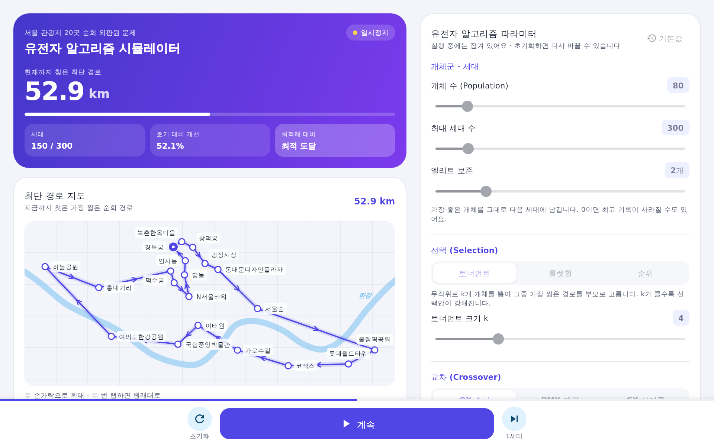

# 서울 TSP GA — 유전자 알고리즘 시뮬레이터

서울의 대표 관광지 20곳을 한 번씩 모두 들르고 돌아오는 **순회 외판원 문제(TSP)** 를
**유전자 알고리즘(GA)** 으로 푸는 과정을 눈으로 확인하는 안드로이드 앱입니다. (Kotlin + Jetpack Compose)

| 휴대폰 | 지도 (다크 모드, 관광지 선택) | 수렴 그래프 (터치해서 값 확인) |
|---|---|---|
|  |  |  |



> 미리보기 이미지는 이 앱의 Compose UI 코드를 데스크톱에서 그대로 렌더링한 것입니다. 실제 기기에서는 글꼴만 조금 다르게 보일 수 있습니다.

## 주요 기능

- **실시간 경로 지도**: 한강을 배경으로 지금까지 찾은 최단 경로와 진행 방향을 그립니다. 두 손가락으로 확대, 두 번 탭하면 원래 크기로 돌아갑니다.
  이름표는 서로 겹치지 않는 자리에만 배치되고, 방문 순서 칩이나 지도의 점을 누르면 해당 관광지가 강조됩니다.
- **수렴 그래프**: 세대가 늘어날수록 **세대 최우수 / 세대 평균 비용(km)** 이 줄어드는 모습을 그립니다.
  - Held-Karp 동적 계획법으로 미리 구한 **정확한 최적해(52.92 km)** 를 기준선으로 표시하고, 처음 도달한 세대에 점을 찍습니다.
  - 초기화하면 직전 실행의 곡선이 점선으로 남아 **파라미터별 결과를 비교**할 수 있습니다.
  - 그래프를 누르거나 좌우로 끌면 해당 세대의 값을 보여 줍니다.
- **모든 인자 조정**

  | 인자 | 범위 | 기본값 |
  |---|---|---|
  | 개체 수 | 20 ~ 500 | 80 |
  | 최대 세대 수 | 50 ~ 2000 | 300 |
  | 엘리트 보존 | 0 ~ 10 | 2 |
  | 선택 방식 | 토너먼트(k = 2~10) / 룰렛휠 / 순위 | 토너먼트, k = 4 |
  | 교차 방식 · 교차율 | OX(순서) / PMX(부분 매핑) / CX(사이클) · 0 ~ 100% | OX · 90% |
  | 돌연변이 방식 · 돌연변이율 | 교환 / 역위 / 뒤섞기 / 삽입 · 0 ~ 100% (개체당) | 역위 · 20% |
  | 난수 시드 | 고정 또는 실행마다 새로 | #212 |
  | 애니메이션 속도 | 느리게 / 보통 / 빠르게 / 최고속 | 보통 |

- **실행 제어**: 시작 · 일시정지 · 계속 · 1세대씩 진행 · 초기화. 같은 시드와 파라미터면 항상 같은 결과가 나옵니다.
- 라이트/다크 모드, 휴대폰(세로)과 태블릿·가로 화면(2단 레이아웃) 모두 지원.

## 실행 방법 (Android Studio)

1. Android Studio(Ladybug 2024.2 이상)에서 **File > Open** → 이 `SeoulTspGA` 폴더를 선택합니다.
2. Gradle Sync가 끝나면 에뮬레이터나 휴대폰(Android 8.0 이상)을 고르고 ▶ **Run 'app'** 을 누릅니다.
3. 단위 테스트: `app/src/test` 폴더에서 오른쪽 클릭 → **Run 'Tests in ...'** (또는 `./gradlew testDebugUnitTest`).

GitHub에 push하면 Actions(`.github/workflows/android.yml`)가 테스트와 디버그 APK 빌드를 실행하고,
완성된 APK를 실행 결과의 **Artifacts** 에서 내려받을 수 있습니다.

## 문제 정의

- **개체(염색체)**: 20곳의 방문 순서를 나타내는 순열
- **비용(COST)**: 경복궁에서 출발해 모든 곳을 한 번씩 들르고 돌아오는 **직선 거리(하버사인 공식) 합**, 단위 km
- **최적해**: 52.92 km (경복궁 → 인사동 → 명동 → N서울타워 → 남대문시장 → 덕수궁 → 홍대거리 → 하늘공원 → 여의도한강공원 →
  국립중앙박물관 → 이태원 → 가로수길 → 코엑스 → 롯데월드타워 → 올림픽공원 → 서울숲 → 동대문디자인플라자 → 광장시장 → 창덕궁 → 북촌한옥마을 → 경복궁)

한 세대는 **엘리트 보존 → 선택 → 교차 → 돌연변이 → 평가** 순서로 진행됩니다.

## 코드 구조

```
app/src/main/java/com/example/seoultsp/
├── ga/                       # 순수 Kotlin GA 엔진 (안드로이드 의존성 없음)
│   ├── SeoulAttractions.kt   # 관광지 20곳 좌표, 한강 좌표, 최적해
│   ├── DistanceMatrix.kt     # 하버사인 거리 행렬
│   ├── GaConfig.kt           # 모든 파라미터
│   ├── Operators.kt          # OX / PMX / CX 교차, 4가지 돌연변이
│   └── GeneticAlgorithm.kt   # 선택·세대 교체·통계
├── sim/SimulationController.kt   # 실행/일시정지/초기화, 기록 (Compose 상태)
├── ui/                       # Compose 화면 (지도, 그래프, 파라미터 패널, 하단 컨트롤)
├── SimulationViewModel.kt
└── MainActivity.kt
app/src/test/                 # 연산자·GA·컨트롤러 단위 테스트 25개
```
