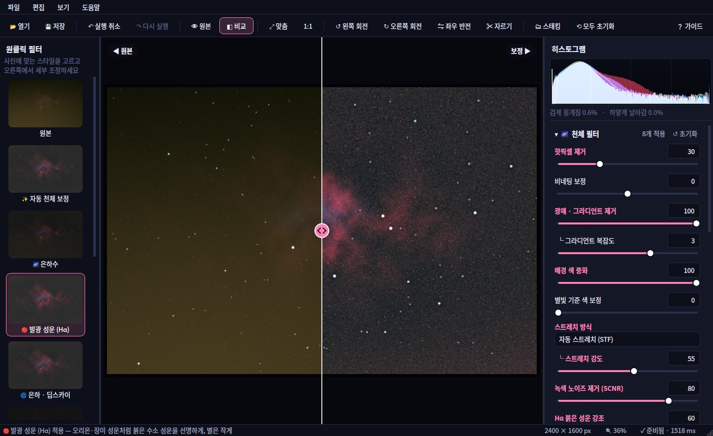

# 🔭 StarLab — 천체 사진 편집기

파이썬으로 만든 **천체 사진 전용 사진 편집 프로그램**입니다.
광해 제거, 스트레치, 녹색 노이즈 제거, 별 줄이기, 스태킹처럼 밤하늘 사진에 꼭 필요한 필터를
**원클릭 필터 + 슬라이더** 방식의 직관적인 화면에서 쓸 수 있습니다.



## 빠른 시작

| 운영체제 | 실행 방법 |
| --- | --- |
| **Windows** | `start_windows.bat` 더블클릭 (처음 한 번은 필요한 패키지를 자동 설치) |
| **macOS / Linux** | 터미널에서 `./start_mac_linux.sh` |
| 직접 실행 | `pip install -r requirements.txt` 후 `python run.py [사진파일]` |

Python 3.9 이상이 필요합니다. ([python.org](https://www.python.org)에서 설치할 때 *Add python.exe to PATH* 체크)

### 처음이라면 이렇게 해보세요

1. **✨ 예제 사진으로 체험하기**를 누릅니다. (광해·노이즈·핫픽셀이 들어간 연습용 성운 사진)
2. 왼쪽 **원클릭 필터**에서 **✨ 자동 천체 보정**을 누릅니다.
3. 오른쪽 슬라이더로 취향껏 다듬습니다. 바뀐 항목은 분홍색으로 표시돼요.
4. **💾 저장** — 원본 해상도로 다시 계산해 새 파일로 저장합니다. (원본 파일은 절대 바뀌지 않아요)

## 주요 기능

### 🌌 천체 필터 (오른쪽 패널, 위에서부터 권장 순서)

| 필터 | 하는 일 |
| --- | --- |
| 핫픽셀 제거 | 장노출에 박힌 빨강·파랑 점을 찾아 지움 (별은 보호) |
| 비네팅 보정 | 렌즈 때문에 어두워진 모서리를 밝게 |
| 광해 · 그라디언트 제거 | 도시 불빛·달빛으로 한쪽이 밝거나 주황색인 하늘을 2차원 다항식 모델로 찾아 평평하게. 성운·은하는 자동으로 제외 |
| 배경 색 중화 | 초록·주황으로 물든 하늘을 무채색으로 |
| 별빛 기준 색 보정 | 별들의 평균 색이 흰색이 되도록 화이트 밸런스 자동 조정 |
| 스트레치 (STF / 아크사인) | 망원경·스태킹 원본처럼 새까만 **선형 데이터**에서 희미한 성운을 끌어올림. 아크사인은 밝은 별의 색을 보존 |
| 녹색 노이즈 제거 (SCNR) | 우주에 없는 초록 기운 제거 |
| Hα 붉은 성운 강조 | 수소 방출 성운의 붉은 빛 강조 |
| 성운 · 은하 디테일 | 먼지띠·성운 구조를 드러내는 다중 스케일 국소 대비 (노이즈는 증폭하지 않음) |
| 별 크기 줄이기 | 별을 찾아 작고 단단하게 (노이즈는 별로 오인하지 않음) |

### ☀️ 톤 · 🎨 색상 · 🔍 디테일
노출, 밝기(중간톤), 대비, 하이라이트, 섀도우, 블랙 포인트, 색온도, 색조, 채도, 자연 채도,
선명하게, 노이즈 감소(별·경계 보호), 색 노이즈 감소.

### ✨ 원클릭 필터 10종
원본 · 자동 천체 보정 · 은하수 · 발광 성운(Hα) · 은하/딥스카이 · 도심 광해 제거 · 달/행성 · 별 궤적 ·
선명한 밤하늘 · 흑백. **현재 사진으로 만든 미리보기 썸네일**을 보고 고를 수 있습니다.

### 🗂 스태킹 (여러 장 합성)
같은 하늘을 연속으로 찍은 사진을 합쳐 노이즈를 줄입니다.
평균 · 중앙값(비행기/위성 궤적 제거) · 시그마 클리핑 · 최대값(별 궤적 만들기) 방식과
별 위치 자동 정렬(평행 이동)을 지원합니다. 사진 여러 장을 창에 끌어다 놓아도 시작됩니다.

### 편하게 쓰는 기능
- **◧ 비교**: 원본/보정본 좌우 분할 비교 (가운데 손잡이를 드래그) · **👁 원본**: 누르고 있는 동안 원본 보기
- **100% 이상 확대 시 원본 해상도로 다시 계산**해서 별 모양·노이즈를 정확히 확인
- 실시간 **히스토그램**과 "검게 뭉개짐 / 하얗게 날아감" 경고
- 무제한 **실행 취소 / 다시 실행**, 슬라이더 이름 더블클릭으로 기본값 복귀
- **자르기**(비율 고정 가능), 90° 회전, 좌우/상하 반전
- **편집 설정 내보내기/불러오기**로 같은 보정을 다른 사진에 적용
- 슬라이더를 움직이는 동안은 빠른 미리보기, 멈추면 선명한 미리보기 (멀티스레드 처리)

## 지원 형식

- 열기: JPG, PNG, TIFF(8/16/32비트), BMP, WEBP
  - `pip install astropy` → **FITS** 천체 데이터
  - `pip install rawpy` → **카메라 RAW** (CR2, CR3, NEF, ARW, DNG, ORF, RW2, RAF …)
  - `pip install imagecodecs` → LZW 압축 16비트 TIFF도 정밀하게
- 저장: **JPEG**(공유용, EXIF 유지), **PNG**(무손실), **TIFF 16비트**(추가 보정용)

## 단축키

| 키 | 기능 | 키 | 기능 |
| --- | --- | --- | --- |
| Ctrl+O | 열기 | Ctrl+S | 저장 |
| Ctrl+Z | 실행 취소 | Ctrl+Shift+Z / Ctrl+Y | 다시 실행 |
| `\` (누르고 있기) | 원본 보기 | C | 비교 |
| R | 자르기 (Enter 적용, Esc 취소) | Ctrl+0 / Ctrl+1 | 화면 맞춤 / 100% |
| 마우스 휠 | 확대·축소 | 드래그 | 화면 이동 |
| Ctrl+[ / Ctrl+] | 90° 회전 | F1 | 보정 가이드 |

## 동작 원리 (개발자용)

- **비파괴 편집**: 원본 픽셀은 그대로 두고, 모든 보정은 파라미터 딕셔너리 하나로 표현됩니다.
  실행 취소는 이 딕셔너리의 스냅샷입니다.
- **보이는 그대로 저장**: 배경 모델·스트레치 기준값 같은 이미지 통계는 미리보기에서 한 번 측정해
  1:1 확대 화면과 원본 해상도 저장에 그대로 재사용합니다.
- **타일 렌더링**: 저장은 여백을 둔 타일 단위로 계산해 큰 사진도 메모리를 적게 쓰며,
  테스트로 전체 한 번에 계산한 결과와 일치함을 확인합니다.
- **멀티스레드**: SciPy 필터가 GIL을 해제하므로 이미지를 띠로 나눠 여러 코어에서 처리합니다.

```
photo_editor/
├── run.py                   # 실행 진입점
├── starlab/
│   ├── processing/          # 화면과 무관한 순수 이미지 처리 (numpy/scipy)
│   │   ├── core.py          #   블러·필터·병렬 처리 기본 도구
│   │   ├── filters.py       #   개별 필터
│   │   ├── pipeline.py      #   필터 순서, 타일/영역 렌더링
│   │   ├── params.py        #   모든 슬라이더 정의 (UI가 여기서 자동 생성됨)
│   │   ├── presets.py       #   원클릭 필터
│   │   └── stacking.py      #   스태킹과 정렬
│   ├── ui/                  # PySide6 화면
│   ├── imageio.py           # 파일 읽기/쓰기
│   ├── document.py          # 열린 사진 + 미리보기 사본
│   └── sample.py            # 연습용 예제 사진 생성
└── tests/                   # python -m pytest tests
```

새 필터를 추가하려면 `params.py`에 슬라이더 한 줄, `filters.py`에 함수 하나,
`pipeline.py`에 호출 한 줄을 넣으면 오른쪽 패널에 자동으로 나타납니다.
